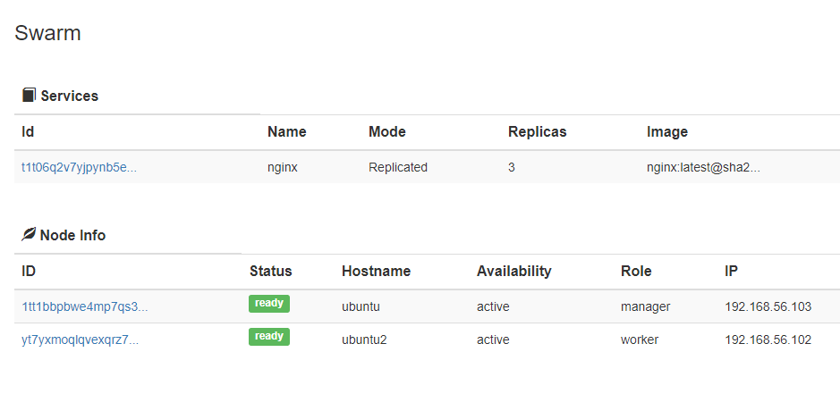
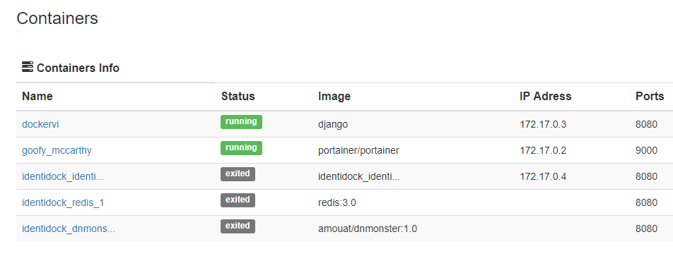
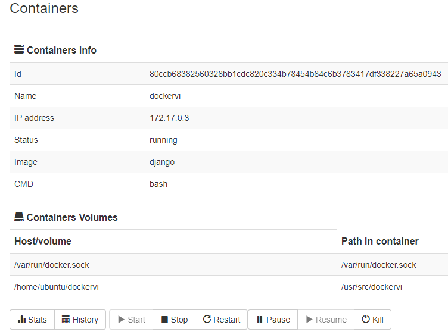
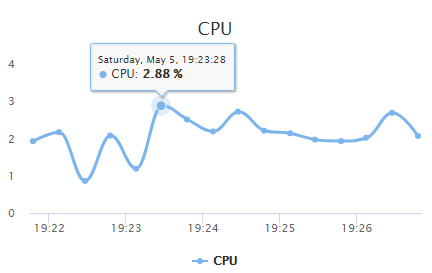

# DockerVI

The purpose of the DockerVI is to monitor the Docker container.

The system based on Django and Docker Python SDK.

### Features:

* Virtualize the monitoring data
* Support real-time data
* Support history-time data (SQLite)
* Support Docker Swarm

This is some demos:

All external plug-ins used by DockerVI include:

* BootStrap
* jQuery
* HighCharts
